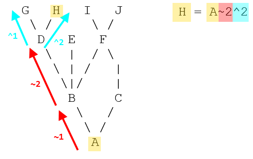

## Git

### Common mistakes fix

__Change a commit message that hasn't been pushed yet__

`git commit --amend -m "New message"`

__Add more files and changes to a commit before pushing__

To add more files to the most recent commit, we can add them to the staging area with:

`git add -A`

and then rewrite the most recent commit to include them with:

`git commit --amend -m "My new message"`
 
__Remove files from staging before committing__

`git reset HEAD filename` to reset a file back to the HEAD pointer.

__Remove changes from a commit before pushing__

`git reset HEAD~1` `git reset [HASH]` to undo the commits before the hash.

The three primary options for `git reset`:

`--soft` puts the files back to staging area

`--mixed` puts the files back to working area (this is the default git reset behavior)

`--hard` removes the files completely

__Recover local changes from `git reset --hard` with `git reflog`__

Use `git reflog` to find the right commit and then `git reset --hard [HASH]` to reset back to that commit hash.

__Undo a commit that has already been pushed__

Use `git revert [HASH]` to revert a commit. NEVER use `git reset` because it will rewrite the history tree, and anyone who has already pulled that branch will have a bad tree.

__Git ignore a file that has already been committed and pushed__

Add the file you want to ignore to `.gitignore`, then we can remove all of our files from git cache with `git rm -r --cached .`, the add back all the files again `git add -A`, this will exclude the files you specify in the `.gitignore`.

However, this method does not actually remove the files in the repo, you can still see them in the git history.

__Completely remove a file from pushed git history__

https://help.github.com/en/github/authenticating-to-github/removing-sensitive-data-from-a-repository

### Fundamentals

At its core, Git is like a key value store. The key is a SHA1 (40-digit hexadecimal number), the value is the compressed data called `blob`, which represents a single file.  For directory, it is stored in a `tree`, which can itself contains `blob` or `tree`. In Git, the same content would only be stored once, which means two identical `blobs` would have exactly the same SHA1 key. All the data about our repository is stored in the hidden `.git` directory.

```
// ask Git for the SHA1 of the contents
echo 'Hello' | git hash-object --stdin

// generate SHA1 of the contents with metadata ('blob 14\0')
// blob indicates it's a blob, 14 is the file size, \0 is the delimiter
echo 'blob 14\0Hello' | openssl sha1
```

In Git, a commit is a code snapshot. Commits point to parent commits and trees.

```
// look at the type of the object using a plumbing command
git cat-file -t 980a0

// look at the content of the object using a plumbing command
git cat-file -p 980a0
```

### Productive tips

__remove all local branches except for 'develop'__

`git branch | grep -v "develop" | xargs git branch -D`

__use wild card to commit some of the files__

`git add src/app/app.component.*`

__make git log pretty and readable__

- edit `~/.gitconfig` file

```
[alias]
      lg = log --color --graph --pretty=format:'%Cred%h%Creset -%C(yellow)%d%Creset %s %Cgreen(%cr) %C(bold blue)<%an>%Creset' --abbrev-commit --branches
```

- use `g lg` to view git log

__discard some commits on a local branch__

```
git reset --hard 9a7f06b
```

This would discard all commits after `9a7f06b`

__change the commit message of the last commit__

`git commit --amend`

__add files that have been forgotten to add to the last commit__

- `git add fileName` to add the file to staging area
- `git commit --amend` to add the file to the last commit

__undo the last commit__

`git reset HEAD~`

### References (pointers) to commits

- Tags
  - tag is just a simple pointer to a commit
  - when you create a tag with no arguments (`git tag ver-1.2`), it captures the value in HEAD

- Branches
  - A branch is just a pointer to a particular commit

- HEAD (pointer to the current commit)
  - HEAD is how git knows what branch you're currently on

Run `cat .git/HEAD` to know where the `HEAD` is currently pointing to.

### Detached HEAD

`git show-ref --heads` to see which commits your HEADs are pointing at.

When you checkout a specific commit or a tag, you get into the detached HEAD state. If you make commits in the detached HEAD state and want to keep your changes, you should create a new branch that points to the last commit you made in a detached state. If you don't create a branch for your changes, eventually they will be garbage collected as they are no longer referenced in Git (dangling commits).

`git branch branchName <commit>`

### Gitflow

GitFlow is a branching model that standardizes branching and merging policy. It uses two branches to record the history of the project. The `master` branch stores the offcial release history, and the `develop` branch serves as an integration branch for features.

How the Gitflow works:

- First we need to create a `develop` branch

```
git flow init
```

- Each new feature should reside in its own branch and a `feature` branch should use `develop` as their parent branch. When a feature is complete, it gets merged back into `develop`

```
// create a feature branch based off develop branch
git flow feature start feature_branch

/* work on the feature branch */

// merge the feature branch into develop branch
// if you do not have permission to merge into develop branch
// you can push the code onto Github and use 'pull request' feature to achieve that
git flow feature finish --squash feature_branch
```

- When you have finished all the features for a release cycle, you fork a `release` branch off of `develop`. At this point, no new features can be added to the `release` branch anymore, only bug fixes can go to the `release` branch. Once it's ready to ship, the `release` branch get merged into `master`. At this point, we should add a version number (tag) to the `master` branch. In addition, it should also be merged back into `develop`, which may have progressed since the release was initiated. Finally, the release branch will be deleted after successfully merging into `master` and `develop`.

```
// create a release branch
git flow release start 0.1.0

/* added bug fixed to the release branch */

// merge the release branch into master branch
git checkout master
git checkout merge release/0.1.0
// merge the release branch into develop branch
git flow release finish '0.1.0'
```

- `hotfix` branch is based on `master` branch in order to quicly patch production releases

```
// create a hotfix branch
git flow hotfix start hotfix_branch

/* work on the hotfix branch */

// merge the hotfix branch into master and develop branches
git flow hotfix finish hotfix_branch
```

#### Reuse Recorded Resolution (ReReRe)

Reuse Recorded Resolution feature would record how you resolve conflict and try to resolve for you the same conflicts automatically.

`git config rerere.enabled true` to enable ReReRe functionality.

`git rerere diff` to see the resolution strategy.

#### git rebase

Rebase is the process of moving or combining a sequence of commits to a new base commit. The primary reason for rebasing is to maintain a linear project history.

`git rebase -i` performs rebase interactively
 
#### git remote

`git remote set-url <name> <url>` change an existing remote repository.

#### git commit

`git commit --amend` to rewrite the most recent commit message in your local repository.

#### git status

Navigate into a subfolder and use `git status .` to get status of just the subfolder.

`git status --short` to display compact status.

#### git mv

`git mv hello.txt hello.html` to rename a file.

#### git grep

`git grep console.log` to print lines matching a pattern, code that contains the word 'console.log' will be printed out in this case.

#### git revert

The difference between `git reset` and `git revert` is the former would rewrite the history, while the latter would preserve the history, which is important in collaborative projects.

`git revert HEAD^` to revert the last commit and add a new commit to undo its changes.

Note: always use `git revert` to undo changes on a collaborated repository. 

#### git tag

`git tag -a v1.0.0 -m 'version 1.0 of my site'` to add a reference to the current commits with an annotation.

`git tag` to list all your tags.

`git show v1.0.0` to see details of an annotated tag.

`git tag -n5` to list all tags along with the first 5 lines of annotations for each tag.

`git show-ref --tags` to list all tags and what commit each tag is pointing to.

`git tag --points-at fc19c45946230064b759616c0d99e3a1ff5b1a41` to list all tags that pointing at a commit.

`git push --tags` to push tags to remote repository.

Using a tag name like v1.0.0 is called semantic versioning. The first number represents a major release which would introduce breaking changes. The second number means a minor release for adding new features. The last one is for patch release indicating bug fixes.

#### git blame

`git blame fileName` to see who made the last change to each line in the file.

#### git diff

`git diff` to compare the difference between the current working directory and the last commit.

`git diff --stat` to get an condensed view of all the difference.

`git diff --cached` to see the difference between working directory and staging area.

`git diff HEAD` to see the difference between working directory + staging area and the last commit.

`git diff origin/master getRandomNumber.js` to see the difference of a specific file between two branches.

#### git log

We can use `/` to initiate a search when viewing git logs (in ternimal pager less), and use `n` to find the next match and `N` to jump to the previous one.

`git --no-pager log --oneline --graph` to condense the log messages into one line and output with no pager.

`git log --since="yesterday"`, `git log --since="2 weeks ago"` to see commits within a period of time.

`git log --name-status --follow --oneline hello.html` to trace how hello.html has its name changed and moved around in the codebase.

`git log --diff-filter=R --find-renames` to find commits where files have been renamed.

`git log -p` to see all the detailed changes made to each commit.

`git log --stat` to show number of insertion and deletion of each commit.

`git log -3` to show the 3 most recent commits.

`git log --author="dennis"` to list commits by a specific author.

`git log --grep='fixed'` to list commits with log message that matches the specified pattern, contains the word 'fixed' in this case.

You can use multiple flags: `git log --grep='mail' --author=dennis --since=2.weeks`

`git log -i -p -S"math"` to list all the commits that involve the word "math", ignoring case by using `-i` flag.

`git log script.js` to list all commits that involve the script.js file.

We can use multiple arguments such as `git log --stat --oneline`.

#### git show

`git show <commit>` show commit and contents.

`git show <commit> --stat` show files changed in the commit.

#### git stash

`git stash` can temporarily store your changes to revert back to HEAD commit.

`git stash --include-untracked` can temporarily store your changes, even those newly added untracked folders and files.

`git stash save "WIP: making progress on infinite scroll"` can name your stash for easy reference.

`git stash branch <branchName>` to create a branch from a stash.

`git stash list` can list all your stashes.

`git stash show stashName` to examine stash contents.

`git stash apply stashName` to restore stashed temporary changes to working directory.

`git stash drop stashName` to delete a stash.

`git stash clear` to remove all stash entries.

#### git config

`git config --global user.name 'Dennis'` to set up git username.

`git config --global user.email 'dennis@gmail.com'` to set up git email.

`git config --global core.editor vim` to set up code editor for resolving conflicts.

`git config --global alias.graph 'log --graph --oneline'` to set up an alias git command.

`git config --list` to examine the content of `.gitconfig` file.

#### git merge

`git merge branchName` to merge a branch into the current branch (the one with *).

`git merge --squash branchName` to squash then merge a branch into the current branch.

`git merge --no-ff` to retain the history of a merge commit, wich will prevent from executing `fast-forward`.

#### git cherry-pick

We can choose a commit from one branch and apply it onto another by using `git cherry-pick`.

Make sure you are on the branch you want to apply the commit to, then run `git cherry-pick <commit-hash>`.

#### git add

`git add .` and `git add -A` does the same thing since git version 2.x.

`git add -p` allows you to stage commits interactively.

#### git reset

`git reset` reverts changes by moving a branch reference backwards in time to an older commit. In this sense you can think of it as "rewriting history;" `git reset` will move a branch backwards as if the commit had never been made in the first place. So this command should only be used locally for your repository.

`git reset fileName` to remove the file from the staging area, without changing the file in the working area. 

`git reset --hard HEAD^` to reset to the previous HEAD. (You have to use `git reset 'HEAD^'` in zsh)

`^` and `~` are called relative refs. The difference between `^` and `~` can be illustrated by the follow graph.



Both `~` and `^` on their own refer to the parent of the commit (`~~` and `^^` both refer to the grandparent commit, etc.) But they differ in meaning when they are used with numbers:  

`~2` means up two levels in the hierarchy, via the first parent if a commit has more than one parent

`^2` means the second parent where a commit has more than one parent (i.e. because it's a merge)

These can be combined, so `HEAD~2^3` means HEAD's grandparent commit's third parent commit.

`git reset ORIG_HEAD` to undo a git reset.

#### git pull

`git pull` is equal to run `git fetch` and `git merge branchName`.

#### git branch

`git branch newBranchName` to create a new branch.

`git branch -a` to see both local and remote branches.

`git branch -d branchName` to delete a branch.

`git branch -f branchName HEAD~3` moves (by force) the specified branch to three parents behind HEAD

`git branch --merged master` to see all branches that have already been merged into master. (So you can clean them)

`git branch --no-merged master` to see all branches that have not been merged into master.

#### git checkout

`git checkout branchName` to switch to a branch.

`git checkout -` to checkout the previous branch.

`git checkout -- fileName` to replace the working area copy with the version from the current staging area.

`git checkout -b branchName` to create and switch to the newly created branch.

`git checkout -b branchName SHA1` to create a branch based on a commit.

#### .gitignore

We can create a global `.gitignore` file for all projects.

```
cd ~
touch .gitignore_global
vi .gitignore_global
git config --global core.excludesfile ~/.gitignore_global
```
