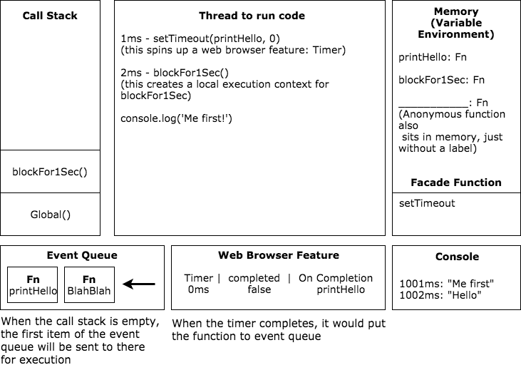

## Javascript

#### Patterns

Revealing module pattern

```js
const UICtrl = (function () {
  // declare private variables and functions
  let text = 'Hello world'

  const changeText = () => {
    const element = document.querySelector('h1')
    element.textContent = text;
  }

  return {
    // declare public variables and functions
    callChangeText: function () {
      changeText();
      console.log(text);
    }
  }
})();
```

Singleton pattern

```js
const Singleton = (function () {
  // declare a variable to hold an instance
  let instance;

  // function to create an instance
  function createInstance () {
    const object = new Object({ name: 'Dennis' })

    return object
  }

  // revealing module pattern
  return {
    getInstance: function () {
      // check if there is already an object in the instance variable
      // if not, then create one, otherwise, return the instance variable
      if (!instance) {
        instance = createInstance()
      }

      return instance
    }
  }
})();

const instanceA = Singleton.getInstance()
const instanceB = Singleton.getInstance()
console.log(instanceA === instanceB) // => true
```

#### Create an immutable object

`const` keywords does not guarantee an unchangable object, it only prevents re-assignment to the variable. To make an object immutable, you need to use `Object.freeze()`.

```js
const config = {
  ... code
}

// make an object immutable
Object.freeze(config);
```

#### Best practice to assign default object to a function

```js
// the function expects a config object
function draw(element, config) {
  // define the default object
  let defaults = {
      width: 200,
      height: 200,
      margin: 28,
      padding: 14
  };

  // solution one, use Object.assign
  config = Object.assign(defaults, config);
  
  // solution two, use spread operator
  config = {
      ...defaults,
      ...config
  }
}

draw(null, { margin: 0, padding: 0 });
```

#### Module vs Module format vs Module loader vs Module bundler

A `module` is a reusable piece of code that encapsulates implementation details and exposes a public API so it can be easily loaded and used by other code.

A `module format` is the syntax we use to define a module. Different module formats such `AMD`, `CommonJS`, `UMD` and `System.register` have emerged in the past and a native module format (import & export) is now available since ES6.

A `module loader` interprets and loads a module written in a certain module format at runtime. Popular examples are `RequireJS` (AMD) and `SystemJS` (CommonJS, UMD, AMD, ES6).

Following is a simple module loader implementation, which is now obsolete and replaced by better implementations. However, it's still good to know how it all started.

```js
function ModuleLoader() {
  /*
  An object to store all the modules

  In this example, it would store two modules:
  HttpClient: { get: function }
  PostManager: { getPosts: function }
  */
  const modules = {};

  // return the implementation of the module
  function getInstance (name) {
    if (modules[name]) {
      return modules[name];
    } else {
      throw new Error(`Undefined module: ${name}`)
    }
  }

  // @param name - name of the module
  // @param dependencies - an array of dependencies
  // @param instance - the actual implementation of the module, normally an object returns an API
  function define (name, dependencies, instance) {
    // check if the module has already been defined
    if (modules[name]) {
      throw new Error(`Module ${name} has already been defined`);
    } else {
      // convert the array of module names into the array of module implementations
      const depsInstances = dependencies.map(dep => {
          return getInstance(dep)
      });

      // use apply() to provide the dependencies as parameters to the instance function
      modules[name] = instance.apply(instance, depsInstances);
    }
  }

  return {
    getInstance: getInstance,
    define: define
  }
}

const loader = ModuleLoader();

// define an HttpClient module
loader.define('HttpClient', [], function HttpClient () {
  function get (url) {
    return fetch(url).then(res => res.json());
  }

  return {
    get: get
  }
})

// define a PostManager module
loader.define('PostManager', ['HttpClient'], function PostManager (httpClient) {
  function getPosts () {
    httpClient.get('https://jsonplaceholder.typicode.com/posts').then(posts => {
      console.log('Posts: ', posts);
    })
  }

  return {
    getPosts: getPosts
  }
})

let postManager = loader.getInstance('PostManager');

postManager.getPosts();
```

A `module bundler` replaces a module loader and generates a bundle of all code at build time. Popular examples are `Browserify`, `Webpack`, `rollup` and `parcel`.

#### Compiler

The Javascript compiler works in two distinct phases, compilation phase and execution phase.

In compilation phase, the Javascript compiler looks through the code and finds out all the variable and function declarations. In addition, it determines what scope these variables and functions are in (scope resolution). The result of this compilation phase is commonly known as `hoisting`.

In execution phase, the Javascript compiler executes the code line by line from top to bottom.

#### __proto__ vs prototype

When we run `Object.create(userFunctionStore);`, the object stored in `userFunctionStore` variable will be added to the `__proto__` property of the new object created by `Object.create()`. So later when we call increment() method on user1 object `user1.increment();`, Javascript will first check if the user1 object has a method named increment, if it cannot find it there, it will look into its `__proto__` property. This is known as prototype chain.

```js
function userCreator(name, score) {
  // create an empty object and refer userFunctionStore object as its __proto__ property value
  let newUser = Object.create(userFunctionStore);
  newUser.name = name;
  newUser.score = score;
  return newUser;
}

let userFunctionStore = {
  increment: function() { this.score++; },
  login: function() { console.log('you are logged in') }
}

let user1 = userCreator('Dennis', 85);

// the increment() method is stored in the userFunctionStore object
// since userFunctionStore is now the object referred by user1.__proto__
// so it's possible to access increment() on user1 object
user1.increment();
```

The `new` keyword simplifies things a bit, which automatically creates a new object and returns it. In addition, the `new` keyword also creates a bond to the `prototype` property of the constructor function by default.

```js
// User object would have a prototype property
function User(name, score) {
  this.name = name;
  this.score = score;
}

User.prototype.increment = function() {
  this.score++;
}

User.prototype.login = function() {
  console.log('login');
}

// create a new User object, which has a __proto__ property that refers to the User.prototype object
let user1 = new User('Dennis', 85);

// the increment() method is stored in the User.prototype object
user1.increment();
```

In ES6, the class syntactic sugar makes things even simpler, however, under the hood it still uses prototype to make it work.

```js
class User {
  constructor (name, score) {
    this.name = name;
    this.score = score;
  }
  
  increment () {
    this.score++;
  }
  
  login () {
    console.log('login');
  }
}

let user1 = new User('Dennis', 85);

user1.increment();
```

Look [here](https://github.com/dennisXZX/dennisxzx.blog.github.io-deprecated/blob/master/_posts/2017-4-27-How-Prototypes-Work.md) for a deep drive into the difference between `__proto__` and `prototype`.

#### Execution context, call stack and lexical scope (closure)

When we run a Javascript file, it creates a global execution context, which contains a thread to run the code synchronously line by line. In addition, a globl variable environment is created to store variables and functions for the global execution context. When a function is executed in the global execution context, a local execution context is created, in which there is a local thread along with a local variable environment for storing local variables and functions.

```
|---------|-------------|
|  thread |   variable  |      
|  to run | environment |
|   code  |             |
|_________|_____________|
    EXECUTION CONTEXT
```

Javascript uses a call stack to keep track of which execution context it is currently in. It starts with the global execution context. When a function is called, a local execution context is pushed into the call stack. And the local execution context is popped out when the function returns explicitly or implicitly (the value `undefined`).

```
|                            |
|_ Local Excution Context B _|
|_ Local Excution Context A _|
|_ Global Excution Context_ _|
          CALL STACK
```

Javascript engine parses your code and convert it to runnable commands (V8 for both Chrome and NodeJS).

Javascript runtime provides some objects to Javascript so that it can interact with the outside world. In Chrome, you have the `browser API, DOM, events and timers`, while in NodeJS offers you `Node API, IO, events and timers`. 

Now let's take a look at lexical scope (closure).

```js
function outer() {
  let counter = 0;
  function incrementCounter () {
    counter++;
  }
  return incrementCounter;
}

let myNewFunction = outer();
myNewFunction();
myNewFunction();
```

When a function is defined it gets a `[[scope]]` property that references the variable environment in which it has been defined. Wherever we call that incrementCounter function, it will always look first in its immediate variable environment for the variable `counter`, and then in the `[[scope]]` property next before it looks any further up.

#### Web browser API, event queue and event loop

What would be the output if we run the following code?

```js
function printHello() {
  console.log('hello');
}

function blockForOneSec() {
  // blocks in the Javascript thread for 1 second
}

setTimeout(printHello, 0);

blockForOneSec();

console.log('me first!');
```

The result will be seeing 'me first' in the console after about 1001 milliseconds and 'hello' after 1002 milliseconds.

This is because when the setTimeout (browser API) completes, the deferred function will be placed in an `event queue`. The deferred function will be added to the call stack only when the call stack is totally empty and no other code need to be run in the global thread. A `event loop` mechanism is used to keep track of this condition. The `event loop` constantly checks for the `event queue` and takes the item at the top of the queue and puts it back to the `call stack` for execution when it's empty.

Here is the diagram for how Javascript engine and browser API work together to execute the code above.



#### Microtask queue vs event queue

```js
console.log('script start');

setTimeout(function() {
  console.log('setTimeout');
}, 0);

Promise.resolve().then(function() {
  console.log('promise1');
}).then(function() {
  console.log('promise2');
});

console.log('script end');
```

The output of this script is...

```
script start
script end
promise1
promise2
setTimeout
```

The reason is that apart from the event queue, there is another queue named microtask queue which takes priority over callback queue. `setTimeout`, `setInterval` and browser events would go into task queue while promise callbacks go into microtask queue. Therefore, promise callbacks are executed prior to tasks in the event queue.

#### Method chaining

The key to achieve method chaining in Javascript is to return `this` keyword in the method.

```js
// define a calculator class
class Calc {
    constructor (start) {
        this.start = start;
    }

    add (x) {
        this.start += x;
        return this;
    };

    multiply (x) {
        this.start *= x;
        return this;
    };

    equals (callback) {
        callback(this.start);
        return this;
    };
}

// create a Calc object and use method chaining
new Calc(0)
    .add(1)
    .add(2)
    .multiply(3)
    .equals((result) => {
        console.log(result);
    })
```

#### Enum in Javascript

Typescript has a new feature called Enum which help group similar values together.

```ts
enum Color { Red, Blue };
```

The compiled Javascript code looks something like:

```js
var Color;

(function(Color) {
  Color[Color["Red"] = 0] = "Red";
  Color[Color["Blue"] = 1] = "Blue";
})(Color || (Color = {}));
```

It is an anonymous function which accept either the Color value or a default empty object.

`Color["Red"] = 0` assigns value 0 to the Red property, so we can access the value 0 using `Color.Red` or `Color['Red']`.

Since the assignment operation `Color["Red"] = 0` returns 0, so `Color[Color["Red"] = 0] = "Red";` actually means `Color[0] = "Red"`.

So after this code, we set both `Color.Red = 0` and `Color[0] = "Red"`. 

#### encodeURI() and encodeURIComponent()

Use encodeURI when you want a working URL.

```js
encodeURI("http://www.example.org/a file with spaces.html");
```

Use encodeURIComponent when you want to encode the value of a URL parameter.

```js
const name = encodeURIComponent('dennis xiao');
const url = "http://example.com/?name=" + name;
```

#### Double !

Double bangs are frequently used as a technique to coerce an object to a boolean value. If the object being coerced was falsey (e.g. 0, null, undefined, etc.), it will be false, otherwise, true.

#### How the bind() function works

This is not exactly how the navtive bind() method is implemented internally. It only intends to give you an overview of how it works.

```js
// the first parameter is the new 'this' context
// parameters after thisArg are some pre-defined arguments for the new method
Function.prototype.bind = function (thisArg, ...fixedArgs) {
    // save the original object
    const func = this;

    // return a new function, which accepts arguments
    return function (...args) {
        // use apply method to change the 'this' context
        // concatenate pre-defined arguments and newly passed arguments
        return func.apply(thisArg, [...fixedArgs, ...args]);
    }
}
```

#### + vs , in console.log()

Using `+` and `,` in console.log() would result in different results.

```js
// using '+' to concatenate an object will call toString() on it, resulting in [object Object] 
// output: App store created: [object Object]
console.log('App store created: ' +  appStore.getState());

// using ',' actually means to pass another argument to console.log
// output: App store created:  { users: {}, items: [] }
console.log('App store created: ',  appStore.getState());
```

#### What is a shim and a polyfill?

A shim intercepts existing API calls and implements different behaviors in order to enhance backward compability.

A polyfill is code that detects if a certain "expected" API is missing and manually implements it.

#### How to enforce a maximum arity (number of passed parameters) for a function?

The ES6 rest operator is a handy way to handle parameters, which completely replaces the use of `arguments` array-like object.

Solution 1

```js
function max(...values) {
    if (values.length > 3) {
        throw Error('max 3 parameters')
    }
    
    let [a, b, c] = values;
    return Math.max(a, b, c);
}
```

Solution 2

```js
function max(a, b, c, ...shouldBeEmpty) {
    if (shouldBeEmpty.length > 0)
        throw Error('max 3 parameters allowed!');
 
    return Math.max(a, b, c);
};
```

#### How to clean up the signature of a function that accepts a large number of parameters?

Sometimes we need to pass a large number of parameters to a function, which is inconvenient and error-prone.

```js
function addPerson(first, last, dob, gender, address) {
  // code
}
```

We can simplify that by introducing a configuraton object.

```js
// wrap all parameters into a configuration object
const config = {
  username: 'dennisboys',
  first: 'dennis',
  last: 'xiao'
}

function addPerson (config) {
  // code
}

addPerson(config);
```

#### How to take advantage of function properties to cache computed results?

Function properties is usually used in memorization pattern, caching the results of a function.

```js
let myFunc = function(param) {
  // if there is no cache in the function, calculate the result
  if (!myFunc[param]) {
    let result = 0;
    
    // do some expensive operation...
    
    // store the operation result
    myFunc[param] = result;
  }
  
  // simply return it if there is already an cached result
  return myFunc[param];
};
```

#### How to check if a value is an array before ECMAScript 5

Array.isArray() is introduced in ECMAScript 5 to determine if a value is an array. Before that, we have to rely on the method of `toString()` to find out the answer.

```js
if (typeof Array.isArray === "undefined") {
  Array.isArray = function(arg) {
    return Object.prototype.toString.call(arg) === "[object Array]";
  };
}
```

#### How to enforce a function to be always called as a constructor?

The following self-invoking constructor pattern can ensure a function is always called as a constructor.

```js
function Person () {
  // check whether this is an instance of your constructor
  if (!(this instanceof Person)) {
    return new Person();
  }
  
  this.name = "Dennis";
}

Person.prototype.sayName = function() {
  return this.name;
}
```

#### What happen under the hood when you invoke a constructor function with a 'new' keyword?

- An empty object is created and referenced by `this` variable, which inherits the prototype object of the function.
- Properties and methods are added to the empty object.
- The newly created object is returned at the end implicitly (if no other object is return explicitly).

#### How to access a global object in all environments?

By returning `this` inside a function, `this` should always point to the global object.

```js
const global = (function() {
  return this;
})();
```

#### How to declare variables in single var/let/const pattern?

```js
let a = 1,
    b = 2,
    sum = a + b
```

#### In JavaScript, what's the difference between this, $(this) and $this?

`this` is a Javascript keyword. The value of `this` varies depending on how a function is invoked. Mainly there are four different patterns.

- when invoked as a function, 'this' refers to the window object in non-strict mode (browser environment), or `undefined` in strict mode. 
- when invoked as a method, 'this' refers to the object that calls the method.
- when invoked as a constructor function, 'this' refers to the object instance created by the constructor.
- when invoked by using call() and apply() method, 'this' refers to the object passed in as the first parameter. If the first parameter is `null`, 'this' would point to the global object.

In ES6, an arrow function does not create its own context, so 'this' has its original context from the enclosing scope.

`$(this)` is not a legitimate Javascript variable. In jQuery library, however, it means to construct a jQuery object so you can call jQuery methods on the object.

`$this` is a legitimate Javascript variable.

#### Explain event delegation

The concept behind this fancy term is actually quite simple. Event delegation simply means you can attach an event listener to a parent element, then events happen in its children will also trigger the event thanks to the event bubbling or event propagation.

#### Explain how `this` works in JavaScript

The value of 'this' is determined by how a function is called.

There are usually four ways of calling a function in Javascript.

1. When called as a function, 'this' refers to the global object, which is the window object in a browser environment (non-strict mode), or `undefined` (strict mode).
2. When called as a method, 'this' refers to the object that invokes the method.
3. When called as a constructor function, 'this' refers to the instance created by the constructor function. However, if in the constructor you explicitly return an object, 'this' would point to that object.
4. When called via call() or apply(), 'this' refers to the first parameter passed into those functions. If the first parameter is `null`, then 'this' would point to the global object.
5. In ES6, an arrow function does not create its own context, so 'this' inherits the function context from the context in which it was created. In addition, you cannot change the 'this' context of an array function, which is determined the moment the arrow function is created. 

Take a look at this example to understand how arrow function affects the value of 'this'.

```js
function Ninja() {
  // the value of 'this' is defined when a new Ninja object is created 
  this.whoAmI = () => this;
}

var ninja1 = new Ninja();

var ninja2 = {
  whoAmI: ninja1.whoAmI
};

// pass
assert(ninja1.whoAmI() === ninja1, "ninja1 here?");

// fail, ninja2.whoAmI() should be equal to ninja1
// because ninja2.whoAmI refers to ninja1.whoAMI, the context of 'this' is defined when a new Ninja object ninja1 is created, so 'this' will always refer to ninja1.
assert(ninja2.whoAmI() === ninja2, "ninja2 here?");
```

#### Explain how prototypal inheritance works

Though Javascript has introduced a new 'class' keyword in ES6, but, under the hood, it still achieves inheritance through prototype.

In Javascript, function is nothing but object, and each object has a 'prototype' object attached to it. Everything in the 'prototype' object is inherited by the instances of that object.

For detailed explanation about Javascript inheritance, I have previously written [a blog post](https://dennisboys.github.io/How-Prototypes-Work/ "How Prototypes Work") about it.

#### AMD vs CommonJS?

Both AMD and CommonJS are specifications on how modules and their dependencies should be declared in Javascript applications. AMD loads modules asynchronously while CommonJS works synchronously.

#### Explain why the following doesn't work as an IIFE: `function foo(){ }();`.

Because it will be treated as a function declaration instead of a function expression. Any statement begins with a `function` keyword will be treated by the Javascript parser as a function declaration. To make this IIFE works, you need to wrap the function with a bracket.

```js
(function foo(){ /* code */ })() or (function foo(){ /* code */ }())
```

Or you are really a tightass who wants to save a byte.

```js
!function(){ /* code */ }();
~function(){ /* code */ }();
-function(){ /* code */ }();
+function(){ /* code */ }();
```

#### What's the difference between a variable that is: `null`, `undefined` or undeclared? How would you go about checking for any of these states?

- 'undeclared' means a variable is not declared with a var, let or const keyword

```js
a = 0;
```

- 'undefined' represents a variable is declared but not assigned a value

```js
var b;
```

- 'null' represents an intentional absence of a value

```js
var c = null;
```

You can use strict equality comparison operator '===' to check the above states.

```js
if (value === undefined) || (value === null)
```

#### What is a closure, and how/why would you use one?

Closure is when a function can remember and access its lexical scope even when it's invoked outside its lexical scope.

Closure is everywhere. It can be used to protect private variables or internal functions, for example, it can be used in pattern like module. Also, when you are using a callback function, chances are you have already run into closure.

#### What's a typical use case for anonymous functions?

Anonymous function can be used in callback function, as it is called by a function instead of by you, so it can go without a function name. Another typical usage of anonymous function is Inmediately Invoked Function Expression (IIFE), as it is invoked the moment defined, so a function name is not necessary. 

#### What's the difference between host objects and native objects?

Host objects are the objects given to you by the environment. Javascript can run on different environments, such as on a browser or a server. Native objects are the objects provided to you by Javascript. You will get the same native objects no matter where you run your Javascript code, but host objects will be different depending on the running environment.

#### Difference between: `function Person(){}`, `var person = Person()`, and `var person = new Person()`?

- function Person(){} declares a constructor function.
- var person = Person() declares a person variable which holds the value returned from calling Person().
- var person = new Person() declares a person variable which holds an instance of the Person object.

#### What's the difference between `.call` and `.apply`?

Both call() and apply() can be used to alter the 'this' context of a function. The difference between them is how they accept parameters. call() accepts parameters one by one explicitly, while apply() accepts an array as its parameter.

#### Explain `Function.prototype.bind`.

Function.prototype.bind is a function defined in the prototype object of Function constructor, which means all instances of Function can access to bind() via prototypal inheritance. The bind function accepts a context as a parameter and returns a function that binds the context to its 'this' keyword. The 'this' context cannot be changed after the binding.

#### When would you use `document.write()`?

In no situation I find myself have a need for document.write(). It was used in the past to inject third party script into a web page, but this approach has been frowned upon due to the performance issue caused.

#### What's the difference between feature detection, feature inference, and using the UA string?

Feature detection is a way of determining if a feature exists in certain browsers.

```js
if (navigator.geolocation) {
  // do something with geolocation
}
```

Feature inference is to assume whether a browser has certain features based on the testing results of another feature. This practice is always frowned upon as it attempts to use multiple features after validating the presence of only one. This might lead to unforeseen issues in the future.

UA string is short for User Agent string, which is a string each browser sends and can be accessed via navigator.userAgent. This string contains information of the browser environment you are targeting.

Luckily, you can use [Modernizr](https://modernizr.com/) library to do feature detection easily.

#### Explain Ajax in as much detail as possible.

Simply put, Ajax is the use of JavaScript to send and receive data using HTTP without refreshing a web page. It is used to make the browsing experience smoother by dynamically updating the content on a web page.

The process of execution of Ajax looks something like the following:

1. A user interaction in a browser triggers an event, such as a button click

2. An XMLHttpRequest object is created by Javascript and sent to a web server

3. The server sends back a response after processing the request from the browser

4. The response is handled by Javascript in the browser to perform appropriate actions

#### What are the advantages and disadvantages of using Ajax?

Advantages: 

1. User experience is much better as no full page reload is required
2. Save bandwidth because only part of the page is dynamically updated

Disadvantages:

1. No browser history is registered for the new state, so it's impossible to use Back and Forward button to navigate between various states of a page
2. User cannot bookmark a specific state of a web page
3. Data loaded through AJjax won't be indexed by search engines
4. The page breaks when Javascript is disabled

#### Explain Cross-Origin Resource Sharing (CORS)

CORS is a mechanism that allows you to work around the same-orign policy implemented by browsers. By enabling CORS on your server, you sepcify what other servers can have access to your resources. 

When Site A tries to fetch content from Site B, Site B can send an `Access-Control-Allow-Origin` response header to tell the browser that the content of this page is accessible to certain origins. (An origin is a domain, plus a scheme and port number.)

By default, Site B's pages are not accessible to any other origins; using the `Access-Control-Allow-Origin` header opens a door for cross-origin access by specific requesting origins.

```
http://foo.example.com:8080/
^^^^   ^^^^^^^^^^^^^^^ ^^^^
 ||           ||        ||
scheme      domain     port
```

```
// On siteB, we can set the Access-Control-Allow-Origin
// allowing siteA to access its content
Access-Control-Allow-Origin: http://siteA.com
```

Therefore, your server would respond to requests with an Access-Control-Allow-Origin header to let the browser know if the requested resource is accessible to those origins.

#### Explain how JSONP works

JSONP stands for JSON with Padding, yet another poorly named term in the programming field. It is a technique to address the same domain policy implemented in the browser land, which relies on `<script>` tags to bypass the restriction.

Say you send a request http://www.example.net/sample.aspx?callback=mycallback to a JSONP enabled server, it will then return a result wrapped in the callback function you specified. Normally the word 'callback' is used as a string query to tell the server it is a JSONP request.

Without JSONP, the returned result would be a run-of-the-mill JSON format.

```js
{ foo: "happy coder" }
```

With JSONP, the returned result would be wrapped in a function.

```js
mycallback({ foo: "happy coder" });
```

So, in your program, you can define a callback function name 'mycallback' to handle the response:

```js
mycallback = function(data) {
  alert(data.foo);
};
```
  
#### Explain "hoisting".

To put it simply, when you declare a variable or a function, it will be hoisted (in layman's terms) to the top of the scope (global scope or function scope). So you can use the variable or call the function even before its declaration. It is important to note that the hoisting applies only to function declaration, not function expression. Another thing to note is functions will be hoisted before variables, so if there is a function named 'bar' and a variable named the same, the variable 'bar' will be ignored because it has already been declared by the function declaration.

But the above statement glosses over a lot of details. The 'hoisting' is actually caused by the way how Javascript engines works. Javascript code interpretation is performed in two phases. During the first phase, the interpreter parses variable and function declarations and put them in memory. This phrase is commonly known as 'hoisting'. In phase two, Javascript engine starts to execute the code. Since variable and function declarations have already been placed in memory in the parsing phrase, that is why we can invoke them in our code before their declarations.

It's important to keep the following rules in mind.

- `Variable assignment` takes precedence over `function declaration`
- `Function declarations` take precedence over `variable declarations`

```js
// this example prints out 'Hello!' because the function declaration takes precedence over variable declaration
sayHello()

function sayHello () {
  function hello () {
    console.log('Hello!')
  }

  hello()

  var hello = 10;
}
```

```js
// this example prints out 'Hello!' because the variable assignment take precedence over function declaration
sayHello()

function sayHello () {
  var hello = function () {
    console.log('Hello!')
  }

  hello()

  function hello () {
    console.log('Hey!')
  }
}
```

#### Describe event bubbling (event propagation).

To put it simply, when an event happens on an element, it first runs the handlers on it, then on its parent, then all the way up on other ancestors.

When an event happens, it is possible to capture where exactly it happens by accessing the `event.target` property. It is important to note `event.target` is not equal to `this`, which refers to an element that registers the triggered event handler.

You can use `event.stopPropagation()` to stop the bubbling, but normally there is no need to do so.

[Here is an article that clearly explains the bubbling concept](http://javascript.info/bubbling-and-capturing "How Bubbling Works")

#### What's the difference between an "attribute" and a "property"?

In Javascript, an object can have as many properties as you want. For example, the following object has two properties, name and age.

```js
let obj = {
  name: 'Dennis',
  age: 34
}
```

Each property of an object has a few built-in attributes, such as `configurable`, `enumerable` and `writable`, etc. Most of the time you don't want to touch these attributes, but in special occasions, you can alter these attributes by calling `Object.defineProperties()` method.

#### Why is extending built-in JavaScript objects not a good idea?

Because when you extend a built-in Javascript object, you change its behavior and that poses a risk to other coders. People who use Javascript native objects would expect they behave the same every where. Therefore, you might inject some surprised moments into their lives by extending built-in objects. 

#### Difference between document load event and document DOMContentLoaded event?

The DOMContentLoaded event is triggered when all the HTML document has been completely loaded. The document load event, on the other hand, is triggered when all the HTML document and its resources (images, styles, etc) have been fully loaded. Therefore, DOMContentLoaded event is triggered before the document load event.

#### What is the difference between `==` and `===`?

The equality operator == will do a type conversion before comparing the two values, while the strictly equality operator === will just compare two values without doing any type conversion. It is highly recommended to use === in development to minimize any risks of unwanted type conversions.

#### Explain the same-origin policy with regards to JavaScript.

The same-origin policy restricts how a script loaded from one origin can interact with a resource from another origin. Two pages have the same origin if the protocol, port (if one is specified), and host are the same for both pages. To bypass the same-origin policy, we have to use [CORS](https://developer.mozilla.org/en-US/docs/Web/HTTP/Access_control_CORS).

#### Make this work:

duplicate([1,2,3,4,5]); // [1,2,3,4,5,1,2,3,4,5]

Use the ES6 spread operator to achieve the duplication.

```js
function duplicate(arr) {
  return [...arr, ...arr];
}
```

#### What is `"use strict";`? what are the advantages and disadvantages to using it?

'use strict' is used to enable strict mode for Javascript. Basically it is used to elimiate some Javascript quirks. For example, in strict mode, the 'this' keyword in a function invocation refers to `undefined` instead of a global `window` object. Also, the implicit `arguments` parameter in a function does not alias declared function parameters anymore.

#### Create a for loop that iterates up to `100` while outputting **"fizz"** at multiples of `3`, **"buzz"** at multiples of `5` and **"fizzbuzz"** at multiples of `3` and `5`

Non-function solution

```js
for (let i=0; i< 101; i++) {
  const isFizz = i % 3 === 0,
        isBuzz = i % 5 === 0;

  let result = '';

  if (isFizz === 0 && isBuzz === 0) {
    result = 'FizzBuzz';
  } else if (isFizz === 0) {
    result = 'Fizz';
  } else if (isBuzz === 0) {
    result = 'Buzz';
  } else {
    result = i;
  }

  console.log(result);
}
```

Functional solution using ternary operator

```js
for (let i=0; i< 101; i++) {
  const isFizz = i % 3 === 0,
        isBuzz = i % 5 === 0;

  const result = 
    isFizz && isBuzz ? 'FizzBuzz'
      : isFizz ? 'Fizz'
        : isBuzz ? 'Fuzz'
          : i;

  console.log(result);
}
```

#### Why is it, in general, a good idea to leave the global scope of a website as-is and never touch it?

- Hard to maintain if you put code in the global scope
- Any function can change a global variable at any point in the program
- Namespace clashes may happen in the global scope

So it is a best pratice to keep the global scope as clean as you can.
