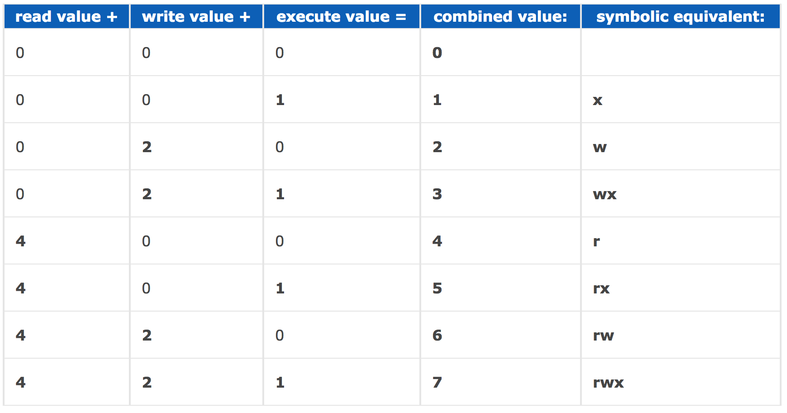

## Linux

#### View running processes

The easiest way to find out what processes are running on your server is to run the `top` command.

Find out all the Node.js related process by `ps aux | grep node`.

#### curl

- get all the content of a website

```
curl https://domain.com
```

- save the output of the URL to a file

```
curl -o api/posts.json https://domain.com/apiData.json
```

- download files

```
// download file.zip and save it to the current working directory 
curl https://domain.com/file.zip -O

// download file.zip to the current working directory and rename it as archive.zip
curl -o archive.zip https://domain.com/file.zip -O

// download multiple files simultaneously
curl -O https://domain.com/file.zip -O https://domain.com/file2.zip

// download file securely via SSH
curl -u user sftp://server.domain.com/path/to/file
```

- get HTTP header info

```
curl -I http://domain.com
```

#### Show how long a command takes to run

```
time yarn webpack
```

#### List files in a tree structure

For MacOS, you need to install a the tree package first `brew install tree`.

```
tree -F
```

#### Navigation in Linux

// go to the previous working directory
cd -

// go to the home directory
cd ~

#### Edit hosts file

Launch Terminal and run `sudo vim /etc/hosts` to edit hosts file.

The `hosts` file is an operating system file that maps hostnames to IP addresses.

#### Exploring the system

There are some common `ls` Options 

- -a, list all files, including hidden files
- -l, list in long format
- -F, indicate directories by placing a '/' at the end of each listed file
- -r, list in reverse order
- -S, sort results by file size
- -t, sort results by modification time

When you use the `-l` format, we can see the access rights to the file. 

```
drwxrwxrwx  18 dennis.x  staff    612 13 Jul 14:09 books
-rwxr-xr--   1 dennis.x  staff   8398  5 Jul 11:06 ei-activity-view.css
```

For `drwxrwxrwx`, the first character indicates the file type, `d` represents a directory while a `-` indicates a regular file.

- The first three symbols `rwx` mean the file's owner may read, write, or execute
- The second three symbols `r-x` mean anyone in the file's group may read or execute this file, but not write to it
- The last three symbols `r--` mean anyone at all may read this file, but not write to it or execute its contents as a process

### Change permissions for files or directories

You can change the permission for a file using `chmod` command.

```
chmod 400 myfile
```

The three number represents the group of User, Group and Other.

Here is how the permission is calculated.

- 4 stands for "read",
- 2 stands for "write",
- 1 stands for "execute", and
- 0 stands for "no permission."

So 7 is the combination of permissions 4+2+1 (read, write, and execute), 5 is 4+0+1 (read, no write, and execute), and 4 is 4+0+0 (read, no write, and no execute).


